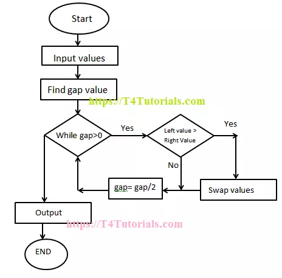

# lesson-4

## While Loops
- Continues to run until the expression inside the while is terminated
- Commonly used with some form of counter

```c
expr1;
while (expr2)
{
  statement
  expr3;
}
```

### While Loop Example

- Note that fahr increases by 20 per iteration.
- /*    */ denotes a multi line comment, // is a single line comment.
- Formatted printing:
	- printf(“%3d %6d\n”, fahr, celsius) to print the first number of each line in a field three digits wide, and the second in a field 6 digits wide.
	- printf(%6.2f, 45.2342) → print as floating point, at least 6 wide and 2 after decimal point


```c
#include <stdio.h>

/* K&R pg. 11
 * print Fahrenheit-Celsius table 
 * for fahr = 0, 20, ..., 300 */

int main()
{
    float fahr, celsius;
    int lower, upper, step;

    lower = 0; /* lower limit of temperature table */
    upper = 300; /* upper limit */
    step = 20; /* step size*/

    fahr = lower;
    while (fahr <= upper)
    {
        celsius = 5.0 * (fahr-32.0) / 9.0;
        printf("%3.0f %6.1f\n", fahr, celsius);
        fahr = fahr + step;
    }
    return 0;
}
```


### Infinite Loop
```c
#include <stdio.h>

int main()
{
    int i = 0;
    while (i >= 0)
    {
        printf("This is an infinite loop! (or is it?) i=%d\n", i);
        i++;
    }
    return 0;
}
```
How will you make the above loop truly infinite?

## For Loops
Similar to while, except in one line

Order of evaluation:
1. initialization with expr1
2. if expr2 is true continue to statement, if not, loop ends
3. do expr3
4. goto step 2


```
for (expr1; expr2; expr3)
    statement
```
A typical expr3 is i++

Any of the three expressions can be omitted, although the semicoloons must remain. Example: 
```
for (;;) { ..}
```
is an “infinite” loop, which can be broken by break or return

** page 57 has the shellsort algorithm written with 3 for loops - it's a good complex example

### For Loops Example
```c
#include <stdio.h>

// K&R pg. 13
// Print Fahrenheit-Celsius table
int main()
{
    int fahr;
    for (fahr = 0; fahr <= 300; fahr += 20)
    {
        printf("%3d %6.1f\n", fahr, (5.0/9.0)*(fahr-32));
    }

    return 0;
}
```

## Symbolic constants:
```c
#include <stdio.h>
#define LOWER 0 		/* lower limit of table */
#define UPPER 300		/* upper limit */
#define STEP 20		/* step size */

// K&R pg. 13
// Print Fahrenheit-Celsius table
int main()
{
    int fahr;
    for (fahr = LOWER; fahr <= UPPER; fahr += STEP)
    {
        printf("%3d %6.1f\n", fahr, (5.0/9.0)*(fahr-32));
    }

    return 0;
}
```

## Basic Arrays
### Declaring and Accesing Arrays

```c
#include <stdio.h>

int main()
{
    int intArr[5];
    intArr[0] = 0;
    intArr[1] = 1;
    intArr[2] = 2;
    intArr[3] = 3;
    intArr[4] = 4;
    printf("%d %d %d %d %d\n",
           intArr[0], intArr[1], intArr[2],
           intArr[3], intArr[4]);

    char charArr[3] = {'A', 'B', 'C'};
    for (int ii = 0; ii < 3; ii++)
    {
        printf("%c ", charArr[ii]);
    }
    charArr[0] = 'Z';
    printf("\n");
    for (int ii = 0; ii < 3; ii++)
    {
        printf("%c ", charArr[ii]);
    }
    return 0;
}
```

One final C operator is the **comma** which most often is used in the for statement. A pair of expressions separated by a comma is evaluated left to right, and the type and value of the result are the type and value of the right operand. Thus in a for statement, it is possible to place multiple expressions in the various parts, for example to process two indices in parallel. 

Comma operators should be used sparingly. The most suitable uses are for constructs strongly related to each other. The commas that separate function arguments, variables in declarations are NOT comma operators. 

#### Example for string reverse:
Note the complex expressions in the for loop.
Strings are just arrays of chars!


```c
#include <stdio.h>
#include <string.h>

// K&R pg. 62
// reverse: reverse string s in place

int main()
{
    char s[] = "CS102";

    int c, i, j;
    for (i=0, j=strlen(s)-1; i<j; i++, j--)
    {
        c = s[i];
        s[i] = s[j];
        s[j] = c;
    }
    printf("%s", s);
    return 0;
}
```
With more commas: 
```c
#include <stdio.h>
#include <string.h>

int main()
{
    char s[] = "hello";
    char c;
    for (int i = 0, j = strlen(s) - 1; i < j; i++, j--)
    {
        c = s[i], s[i] = s[j], s[j] = c;
    }

    printf("%s\n", s);
    return 0;
}
```


## Count Digits, White Space, and Others
- Run the program against itself with ./a.exe < count.c
- Array is defined as int ndigit[10];

```c
#include <stdio.h>

// K&R pg. 22
// count digits, white space, others

int main()
{
    int c, i, nwhite, nother;
    int ndigit[10];

    nwhite = nother = 0;
    for (i = 0; i < 10; ++i)
    {
        ndigit[i] = 0;
    }

    while ((c = getchar()) != EOF)
    {
        if (c >= '0' && c <= '9')
            ++ndigit[c - '0'];
        else if (c == ' ' || c == '\n' || c == '\t')
            ++nwhite;
        else
            ++nother;
    }

    printf("digits =\n");
    for (i = 0; i < 10; ++i)
        printf("\t%d-->%d\n", i, ndigit[i]);
    printf("white space = %d\nother = %d\n",
           nwhite, nother);

    return 0;
}
```

## AtoI
- Note that the functionality is living in main.
- Note that a lot of curly braces are not necessary.
- How would you modify this to use user input?

```c
#include <stdio.h>
#include <ctype.h>

// K&R pg. 61
// atoi: convert s to integer; version 1
int main()
{
    char s[] = "-10";

    int i, n, sign;

    for (i = 0; isspace(s[i]); i++) // skip white space
        ;
    sign = (s[i] == '-') ? -1 : 1;
    if (s[i] == '+' || s[i] == '-') // skip sign
        i++;
    for (n = 0; isdigit(s[i]); i++)
        n = 10 * n + (s[i] - '0');

    int result = sign * n;
    printf("%d", result);
    return 0;
}
```


## AtoI With getchar()
```c
#include <stdio.h>
#include <ctype.h>

// K&R pg. 61
// atoi: convert s to integer; version 1
int main()
{
    char s[5]; // needs a const
    char c = getchar();
    int cidx = 0;
    while (c != '\n')
    {
        s[cidx] = c;
        c = getchar();
        cidx++;
    }


    int i, n, sign;

    for (i = 0; isspace(s[i]); i++) // skip white space
        ;
    sign = (s[i] == '-') ? -1 : 1;
    if (s[i] == '+' || s[i] == '-') // skip sign
        i++;
    for (n = 0; isdigit(s[i]); i++)
        n = 10 * n + (s[i] - '0');

    int result = sign * n;
    printf("%d", result);
    return 0;
}
```

## Do While
In contrast to the while and for loop, the body is executed first, and then the condition is tested. The do will always execute first, and is executed at least once.
This loop will end when the while part is not satisfied.
```
do
    statement
while (expression);
```

### Do While Example

The do-while is necessary, or at least convenient, if at least one character must be installed in the array s, even if is zero.
The job of itoa is slightly more complicated than might be thought at first, because the easy methods of generating the digits generate them in the wrong order. So we have chosen to generate the string backwards, then reverse it.

```c
#include <stdio.h>
#include <string.h>

// K&R pg. 64
// itoa: convert n to characters in s

int main()
{
    int n = -77;
    char s[10];

    int idx, sign;
    if ((sign = n) < 0) // record sign
        n = -n;         // make n positive
    idx = 0;
    do {
        s[idx++] = n % 10 + '0';
    } while ((n /= 10) > 0);
    if (sign < 0)
        s[idx++] = '-';
    s[idx] = '\0';

    // reverse s
    int c, i, j;
    for (i=0, j=strlen(s)-1; i<j; i++, j--)
    {
        c = s[i];
        s[i] = s[j];
        s[j] = c;
    }
    printf("%s", s);
    return 0;
}
```

## Break & Continue

**break** -- allows you to exit the innermost enclosing loop immediately
- Can be used in a for, while, or do loop
- We have seen this used in switch

**continue** -- allows the next iteration of the enclosing loop to begin
- Can be used in a for, while, or do loop
- In the while and do this means that the test part is executed immediately, in the for loop, control passes to the increment step.
- Continue does not apply to switch.  A continue inside a switch inside a loop causes the next loop iteration.

## Break Example

```c
#include <stdio.h>
#include <string.h>

// K&R pg. 65
// trim: remove trailing blanks, tabs, newlines
int main()
{
    char s[] = "HELLO   ";
    int n;
    for (n = strlen(s)-1; n >= 0; n--)
        if (s[n] != ' ' && s[n] != '\t' && s[n] != '\n')
            break;
    s[n+1] = '\0';
    printf("%d\n", n);
    printf("%s.", s);

    return 0;
}
```

## Continue Example
```c
#include <stdio.h>

// skip printing a number with continue

int main()
{
    for (int ii=0; ii<=10; ii++)
    {
        if (ii==7)
            continue;
        printf("%d ", ii);
    }

    return 0;
}
```

# Looking Ahead


## Shell Sort
Note the nested loops.
You will learn more about sorts in DSA I.

```c
#include <stdio.h>

// K&R pg. 62
// shellsort: sort v[0]...v[n-1] into increasing order
int main()
{
    int v[10] = {4, 6, 2, 1, 3, 5, 7, 9, 8, 0};
    int n = 10;
    int gap, i, j, temp;
    for (gap = n/2; gap > 0; gap /= 2)
        for (i = gap; i < n; i++)
            for (j=i-gap; j>=0 && v[j]>v[j+gap]; j-=gap)
            {
                temp = v[j];
                v[j] = v[j+gap];
                v[j+gap] = temp;
            }

    printf("Sorted: ");
    for (int ii=0; ii<n; ii++)
        printf("%d ", v[ii]);

    return 0;
}
```


#### Shell Sort example with helpful printf statements
```c
#include <stdio.h>

// K&R pg. 62
// shellsort: sort v[0]...v[n-1] into increasing order
int main()
{
    int v[10] = {4, 6, 2, 1, 3, 5, 7, 9, 8, 0};
    int n = 10;
    int gap, i, j, temp;
    printf("start: ");
    for (int k = 0; k < 10; k++)
        printf("%d ", v[k]);
    printf("\n");
    for (gap = n / 2; gap > 0; gap /= 2)
    {
        printf("compare all numbers with a gap: %d\n", gap);
        for (i = gap; i < n; i++)
            for (j = i - gap; j >= 0 && v[j] > v[j + gap]; j -= gap)
            {
                printf("\t");
                // print list so far
                for (int k = 0; k < 10; k++)
                    printf("%d ", v[k]);

                temp = v[j];
                v[j] = v[j + gap];
                v[j + gap] = temp;
                printf("\tj=%d j+gap=%d \t", j, j + gap);
                // print list after swap
                for (int k = 0; k < 10; k++)
                    printf("%d ", v[k]);
                printf("\n");
            }
    }
    printf("Sorted: ");
    for (int ii = 0; ii < n; ii++)
        printf("%d ", v[ii]);

    return 0;
}
```


 
# Homework:
- The C Programming Language, 2nd Edition - Kerninghan & Ritchie, Chapter 1.2, 1.3, 1.5, 1.6, 1.7, 3.4, 3.5, 3.6, 3.7, 3.8, 4.1, 4.2
- coding hw assignment: https://classroom.github.com/a/dFn_bZ7d
- reminder, quiz next week! practice quiz: https://github.com/CS102-Classroom-Notes-and-Assignments/quiz-1-practice
